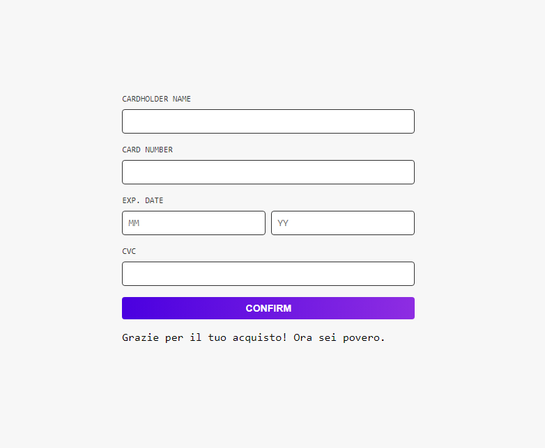
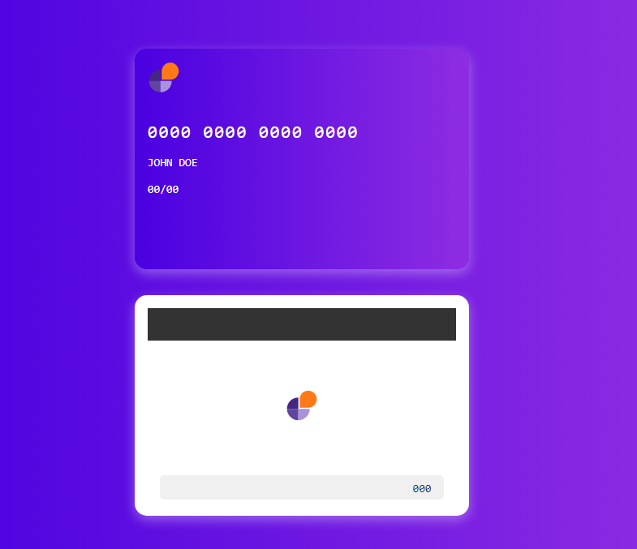

# 🌟 Interactive Credit Card Form 🌟

## 📋 Descrizione

Questa applicazione è un form interattivo per l'inserimento dei dati di una carta di credito. L'utente può inserire i dati della carta e vedere le modifiche riflettersi direttamente su una rappresentazione visiva della carta. L'applicazione include anche una modale di conferma dell'acquisto.

## 🚀 Tecnologie Utilizzate

- **Next.js** - Framework React per applicazioni lato server e lato client.
- **React** - Libreria per la costruzione di interfacce utente.
- **SASS (SCSS)** - Preprocessore CSS per stili modulari e avanzati.
- **JavaScript (ES6)** - Linguaggio di programmazione per la logica dell'applicazione.

## 🎨 Stile e Design

- **Font**: Roboto Mono
- **Colori**:
  - Primario:  `#7209b7`
  - Secondario:  `#00004f`
  - Bianco:  `#ffffff`
  - Grigio Chiaro:  `#f7f7f7`
  - Grigio Scuro:  `#333333`
- **Gradiente**:
  - Sfondo della carta e dello sfondo: `linear-gradient(to right, #4A00E0, #8E2DE2)`
  - Pulsante: `linear-gradient(to right, #4A00E0, #8E2DE2)`

## 🛠️ Funzionalità

1. **Form di Input**: Consente agli utenti di inserire i dati della carta di credito (Nome del titolare, Numero della carta, Data di scadenza, CVC).
   - Il Numero della carta e il CVC accettano solo input numerici.
   - Il Nome del titolare accetta solo lettere.

2. **Rappresentazione Visiva della Carta**: Mostra una carta di credito con i dettagli inseriti dall'utente.
   - Aggiornamento dinamico mentre l'utente inserisce i dati.
   - Fronte della carta mostra il numero della carta, il nome del titolare e la data di scadenza.
   - Retro della carta mostra il CVC all'interno di una signature box.

3. **Modale di Conferma**: Quando l'utente clicca su "Confirm", si apre una modale con due opzioni:
   - **Si**: Conferma l'acquisto e mostra un messaggio di ringraziamento.
   - **No**: Chiude la modale senza confermare.

## 🖼️ Screenshot

### Form di Input

### Carta di Credito

### Modale di Conferma

📝 Note
Assicurati di avere Node.js e npm installati sulla tua macchina.
Il progetto utilizza Next.js 14.2.5, assicurati di utilizzare una versione compatibile di Node.js.

❤️ Creato con amore da Roberta Favuzza ❤️